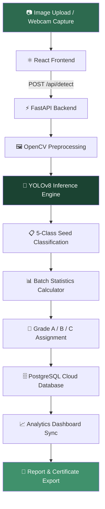

<div align="center">


<br /><br />

```
███╗   ███╗ █████╗ ██╗███████╗███████╗███████╗ ██████╗ █████╗ ███╗   ██╗
████╗ ████║██╔══██╗██║╚══███╔╝██╔════╝██╔════╝██╔════╝██╔══██╗████╗  ██║
██╔████╔██║███████║██║  ███╔╝ █████╗  ███████╗███████╗██║  ╚═╝██╔██╗ ██║
██║╚██╔╝██║██╔══██║██║ ███╔╝  ██╔══╝  ╚════██║██╔══██║██║  ██╗██║╚██╗██║
██║ ╚═╝ ██║██║  ██║██║███████╗███████╗███████║╚█████╔╝╚█████╔╝██║ ╚████║
╚═╝     ╚═╝╚═╝  ╚═╝╚═╝╚══════╝╚══════╝╚══════╝ ╚════╝  ╚════╝ ╚═╝  ╚═══╝
```

# 🌽 MaizeScan — AI-Powered Maize Seed Quality Analysis

**Automate seed grading with computer vision. Detect defects in milliseconds. Make better agricultural decisions.**

[🚀 Live Demo](#) · [📖 Documentation](#) · [🐛 Report Bug](../../issues) · [✨ Request Feature](../../issues)

<br />

</div>

---

## 📽️ Demo

> **Watch MaizeScan in Action**

<div align="center">

<!-- Replace the URL below with your actual demo video link -->
[](https://your-demo-video-link-here.com)

<!-- 
  OPTION 1: If you have a video hosted on YouTube / Google Drive / etc., use the badge above.
  
  OPTION 2: If you have a GIF of your project, upload it to the repo and embed it like this:
  
  
  OPTION 3: If you uploaded a video to GitHub directly (under /assets), embed thumbnail + link like this:
  <a href="./assets/demo.mp4">
    
  </a>
-->

</div>

---

## 🧠 What is MaizeScan?

Traditional seed grading is **manual, slow, and inconsistent** — introducing human error at the most critical stage of the agricultural supply chain.

**MaizeScan** solves this with AI. Upload a batch image or point a webcam at seeds — and within milliseconds, our custom-trained **YOLOv8 model** identifies every visible kernel, classifies it into one of five quality grades, and generates a full analytics report.

> Designed for farmers, seed labs, agri-startups, and agricultural researchers.

---

## ✨ Key Features

| Feature | Description |
|---|---|
| 🤖 **AI Seed Detection** | YOLOv8-powered real-time detection with bounding boxes and per-seed classification |
| 📷 **Dual Input Modes** | Supports both image uploads and live webcam streams |
| 📊 **Batch Analytics** | Automated quality distribution, visual purity score, and defect rate per batch |
| 🏅 **Smart Grading** | Intelligent Grade A / B / C assignment based on seed distribution logic |
| 📈 **Analytics Dashboard** | Historical trends, pie charts, bar charts, batch comparison graphs |
| 📄 **Instant Reports** | Export-ready quality certificates with full batch statistics |
| 👤 **Secure Multi-User** | JWT-authenticated accounts with private batch history per user |
| 🌾 **Farmer Knowledge Hub** | Multilingual (English, Hindi, Marathi) guide with defect library and video resources |

---

## 🌿 Seed Quality Classification

MaizeScan detects every seed and assigns one of five quality grades:

```
┌─────────────┬──────────────────────────────────────┬───────────┐
│   Grade     │ Description                          │ Indicator │
├─────────────┼──────────────────────────────────────┼───────────┤
│ Excellent   │ Fully healthy, defect-free kernel    │ 🟢 Green  │
│ Good        │ Minor surface imperfections          │ 🟡 Yellow │
│ Average     │ Moderate quality, visible wear       │ 🟠 Orange │
│ Bad         │ Visible damage — cracks, discolor    │ 🔴 Red    │
│ Worst       │ Severely damaged / mold infected     │ ⚫ Black  │
└─────────────┴──────────────────────────────────────┴───────────┘
```

### 🏅 Batch Grading Logic

| Final Grade | Condition | Interpretation |
|---|---|---|
| **Grade A** | Sound seeds ≥ 90% AND Defective ≤ 3% | Premium seed quality |
| **Grade B** | Sound seeds ≥ 80% AND Defective ≤ 7% | Commercial grain standard |
| **Grade C** | Sound seeds < 80% | Substandard — not recommended |

> ⚠️ MaizeScan performs **visual screening only**. Germination rate and moisture testing must be conducted separately through lab processes.

---

## 🛠️ Technology Stack

<div align="center">

| Layer | Technology | Purpose |
|---|---|---|
| 🧠 **AI Core** | Ultralytics YOLOv8 + OpenCV + Python 3.10 | Detection, classification, preprocessing |
| ⚙️ **Backend** | FastAPI + SQLAlchemy + PostgreSQL (NeonDB) + JWT | API, inference, auth, persistence |
| 🎨 **Frontend** | React 18 + Vite + Recharts + Framer Motion | UI, analytics, animations |
| ☁️ **Deployment** | Vercel (Monorepo) | Full-stack deployment |

</div>

---

## 🔄 System Architecture



**Pipeline summary:**
1. **Capture** — Frontend captures a seed tray image via upload or webcam
2. **Inference** — FastAPI backend processes the image in under 200ms, identifying every kernel
3. **Analysis** — Weighted quality scores computed from seed class distribution
4. **Storage** — Results persisted to cloud DB and immediately reflected in the dashboard
5. **Export** — Presentation-ready reports and grade certificates generated on demand

---

## 🚀 Getting Started

### Prerequisites

- Python 3.10+
- Node.js 18+
- PostgreSQL (or a NeonDB cloud connection string)

### 1. Clone the Repository

```bash
git clone https://github.com/your-username/maizescan.git
cd maizescan
```

### 2. Set Up the AI Backend

```bash
# Create and activate virtual environment
python -m venv .venv
.\.venv\Scripts\activate       # Windows
source .venv/bin/activate      # macOS / Linux

# Install dependencies
pip install -r requirements.txt

# Configure environment variables
cp .env.example .env
# → Fill in DATABASE_URL, SECRET_KEY, ALGORITHM in .env

# Start the backend server
python -m uvicorn backend.main:app --reload --port 8000
```

### 3. Start the Frontend

```bash
cd frontend
npm install
npm run dev -- --port 5173
```

Then open [http://localhost:5173](http://localhost:5173) in your browser.

---

## ☁️ Deployment (Vercel)

This project is pre-configured for **Vercel Monorepo Deployment**:

1. Push the repository to GitHub
2. Import it into [Vercel](https://vercel.com)
3. Add the following environment variables in the Vercel dashboard:
   - `DATABASE_URL`
   - `SECRET_KEY`
   - `ALGORITHM`
4. Deploy — Vercel auto-detects `vercel.json` and builds both the frontend and backend

---

## 📊 Analytics Dashboard

The personalized dashboard gives every user a full view of their seed inspection history:

- **Summary cards** — Total batches, total seeds analyzed, average quality score, defect rate
- **Quality pie chart** — Visual distribution across all 5 seed classes
- **Batch trend graph** — Quality score over time for longitudinal tracking
- **Seed count bar chart** — Comparison across batch sessions
- **Batch history table** — Searchable, sortable record of all past analyses

---

## 📖 Farmer Knowledge Hub

The built-in educational portal supports **farmers, students, and agricultural researchers**:

- Maize seed grading standards explained
- Illustrated defect library (mold, insect damage, mechanical cracks)
- Storage best practices and post-harvest guides
- Germination improvement tips
- Available in **English, Hindi, and Marathi**

---

## 📁 Project Structure

```
maizescan/
├── backend/
│   ├── main.py               # FastAPI entry point
│   ├── models/               # SQLAlchemy ORM models
│   ├── routers/              # API route handlers
│   ├── ai/                   # YOLOv8 inference module
│   └── utils/                # Grading logic, preprocessing
├── frontend/
│   ├── src/
│   │   ├── pages/            # Detection, Dashboard, Reports, Guide
│   │   ├── components/       # Reusable UI components
│   │   └── api/              # Axios API client
│   └── vite.config.js
├── model/
│   └── maize_yolov8.pt       # Custom-trained YOLOv8 weights
├── vercel.json               # Vercel monorepo config
└── README.md
```

---

## 🤝 Contributing

Contributions are welcome! Here's how:

```bash
# 1. Fork the repository
# 2. Create your feature branch
git checkout -b feature/AmazingFeature

# 3. Commit your changes
git commit -m 'Add AmazingFeature'

# 4. Push to the branch
git push origin feature/AmazingFeature

# 5. Open a Pull Request
```

---

## 📜 License

Distributed under the MIT License. See [`LICENSE`](./LICENSE) for details.

---

## 🙏 Acknowledgements

- [Ultralytics YOLOv8](https://github.com/ultralytics/ultralytics) — Object detection framework
- [FastAPI](https://fastapi.tiangolo.com/) — High-performance Python API framework
- [NeonDB](https://neon.tech/) — Serverless PostgreSQL
- [Vercel](https://vercel.com/) — Deployment platform

---

<div align="center">

**Built with ❤️ for the Future of Sustainable Agriculture**

🌽 *MaizeScan — See every seed. Grade every batch. Trust every harvest.*

</div>
